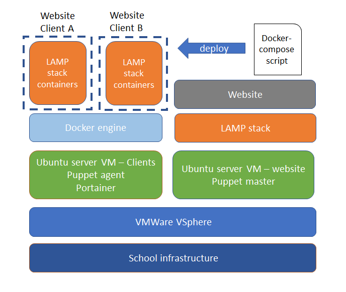
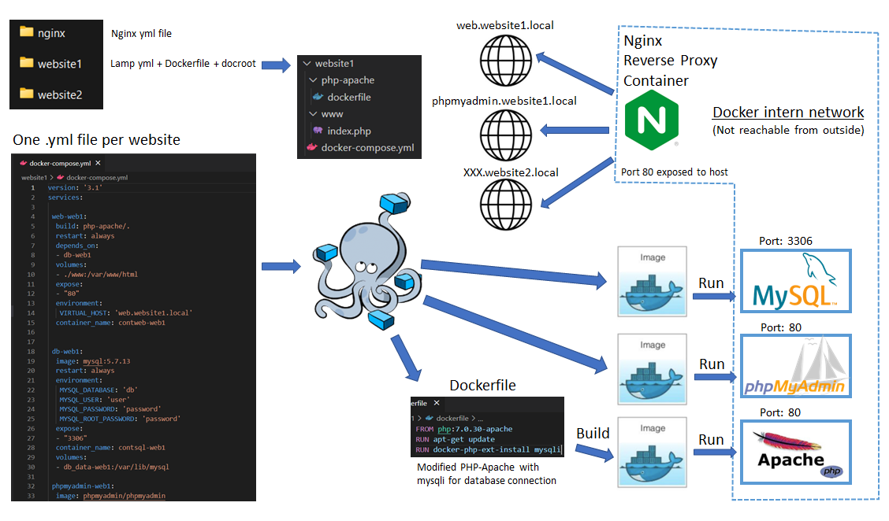
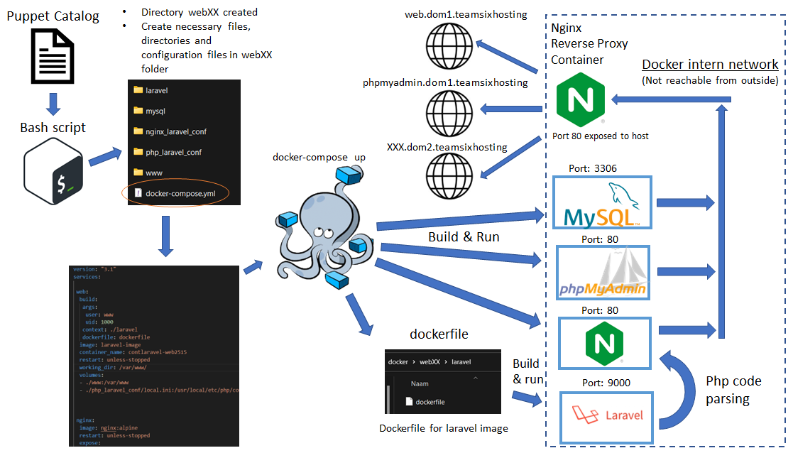

# Project hosting Team 6
## Shematics

Schema infrastructure:\


Schema Docker lamp:\


Schema Docker-Laravel Bash script:\



## Prerequisites
For everything to work you'll need:
- Docker
- Docker-Compose
## Setup


You'll find everything you need under the `docker` directory. There's two components you will use: The Nginx Reverse Proxy under the directory _nginx_ and the bash script `script.sh`. 

The reverse proxy needs to be started __once__ at first by going to its directory and using docker compose to build and run the docker container. A network has to be created too.
```bash
docker network create net-hosting
```

```bash
cd ./projecthosting/docker/nginx
docker-compose up -d
 ```

Then we give the bash script execute rights and run the script. For each new __laravel app__, you just execute the script again.

```bash
cd ../
chmod +x ./script_laravel.sh
./script_laravel.sh
```
__OR__

If you just want a normal __lamp stack__ execute this one.
```bash
cd ../
chmod +x ./script_lamp.sh
./script_lamp.sh
```

The script creates a whole directory for your website. It will be named something like __webXX__. 

In this folder you'll find another folder `www` where your laravel website should be stored, and `mysql` where all sql data is stored.

The script will tell you the Virtual Host names of your site.

Everything should now be up and running!

after adding the your project files to `www`, you can run the next command to install the dependencies if you have a composer.json file

```bash
docker-compose exec web composer install
```

To visit the website, you add the virtual host names together with the machine's ip to your hosts file. It will look someting like this:
```
192.168.0.XX web.milansterkenswebXX.teamsixhosting 
192.168.0.XX phpmyadmin.milansterkenswebXX.teamsixhosting
```


## Remove/Stop a website

first you shut down al associated docker containers by going to the site's folder and run:

```bash
docker-compose down
docker-compose rm -f
```
After this you can delete the whole directory if you want.

### TODO
- finish script
